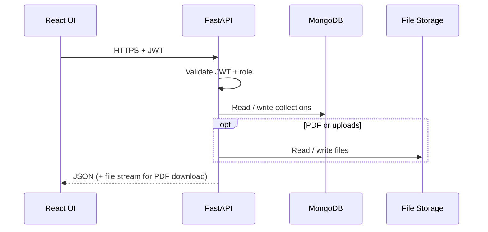
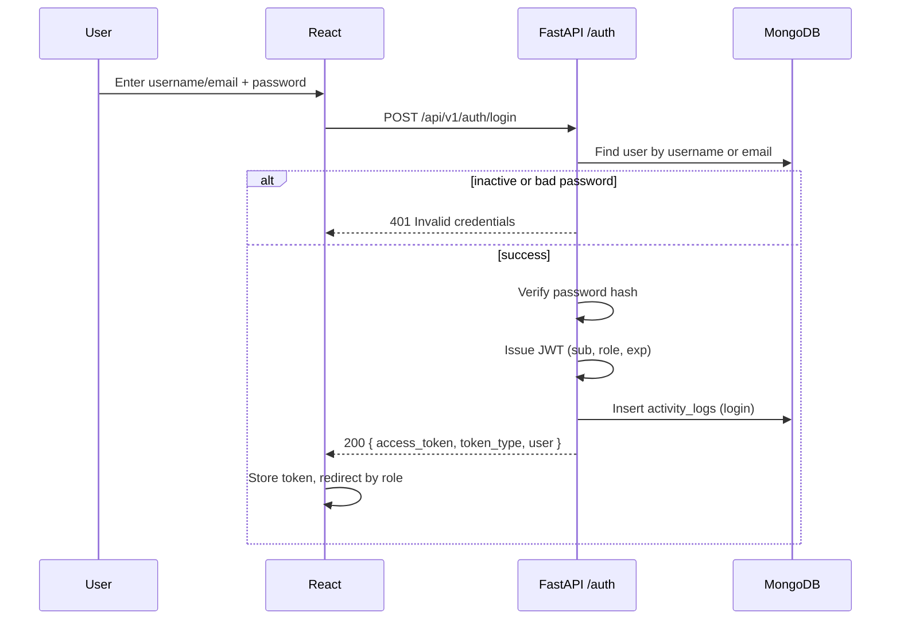
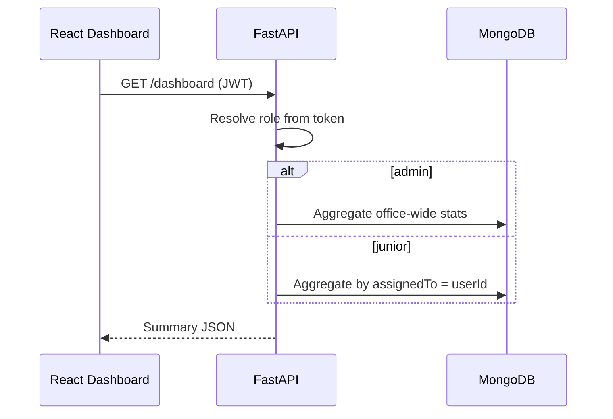
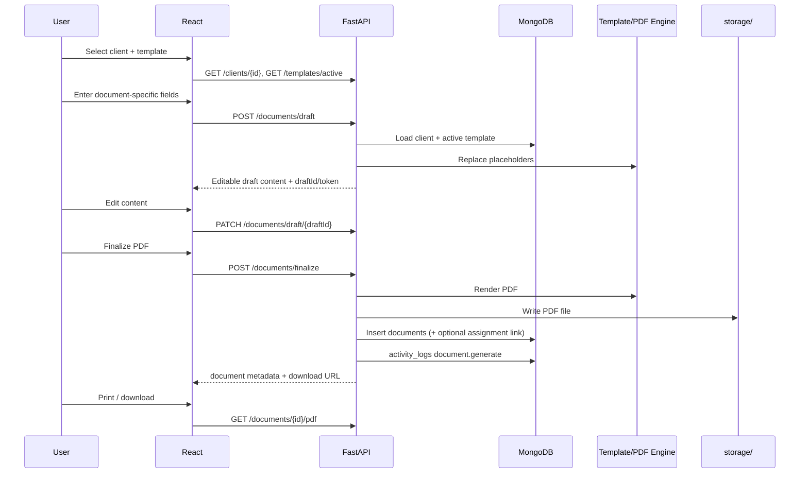
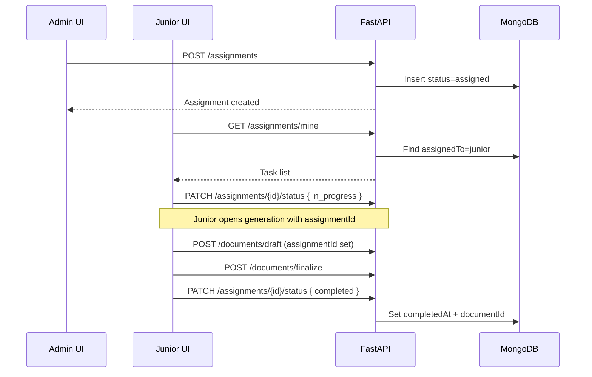
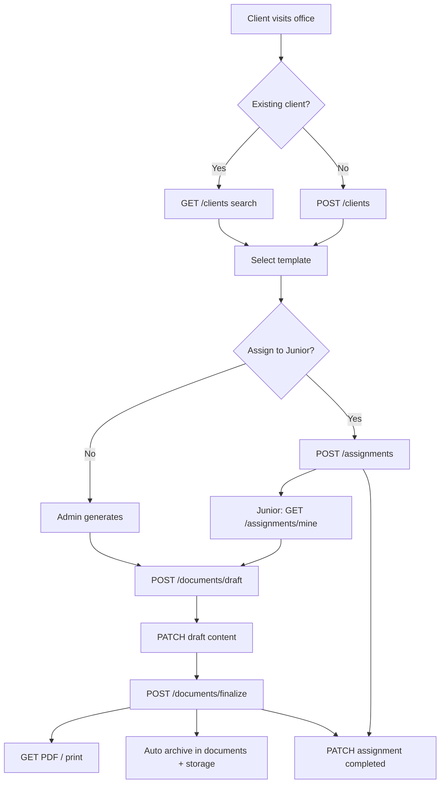

# NDAOMS — API Flow

**System:** Notary Document Automation and Office Management System  
**API style:** REST (JSON)  
**Backend:** Python **FastAPI**  
**Auth:** JWT Bearer tokens  
**Base URL:** `/api/v1`  
**Version:** 1.0 (aligned with SRS)

---

## 1. Overview

The FastAPI backend exposes versioned REST endpoints for authentication, clients, templates, document generation, assignments, archive search, dashboards, and admin reports.

```text
React (Tailwind)  --HTTPS/JSON-->  FastAPI  --motor/pymongo-->  MongoDB
                                      |
                                      +--> storage/ (PDFs, photos, templates)
```

All protected routes require:

```http
Authorization: Bearer <access_token>
```

---

## 2. Conventions

| Topic | Convention |
|-------|------------|
| Success | `200` / `201` with JSON body |
| Validation error | `422` (FastAPI) or `400` with field messages |
| Auth failure | `401` |
| Forbidden (role) | `403` |
| Not found | `404` |
| Conflict (duplicate) | `409` (e.g. duplicate Aadhaar) |
| IDs in URLs | MongoDB ObjectId string or business code (`CLT-...`) — prefer ObjectId in paths |
| Pagination | `?page=1&limit=20` |
| Dates | ISO-8601 UTC |

### Standard response envelope (recommended)

```json
{
  "success": true,
  "data": {},
  "message": "optional"
}
```

List responses:

```json
{
  "success": true,
  "data": [],
  "meta": { "page": 1, "limit": 20, "total": 100 }
}
```

---

## 3. Roles & Access Matrix

| Area | Admin | Junior |
|------|-------|--------|
| Auth (login/logout/change password) | yes | yes |
| User management | yes | no |
| Dashboard (own role view) | full office stats | own assignments |
| Clients (CRUD/search) | yes | yes (no hard delete) |
| Templates | yes | no (read active list only during generation) |
| Document generate / edit / PDF / print | yes | yes |
| Assignments create / reassign | yes | no |
| Assignments view / update status | yes (all) | own only |
| Archive search / download / print | yes (all) | yes (policy: all office docs in v1, or own — confirm before launch) |
| Reports | yes | no |

**v1 default for archive:** Junior may search/view documents they generated or that are linked to their assignments. Admin sees all. Document this in middleware.

---

## 4. High-Level Request Flow



---

## 5. Authentication Flow (FM-01)

### 5.1 Login sequence



### 5.2 Auth endpoints

| Method | Path | Auth | Description |
|--------|------|------|-------------|
| `POST` | `/api/v1/auth/login` | public | Login with username/email + password |
| `POST` | `/api/v1/auth/logout` | JWT | Client discards token; server may blacklist if implemented |
| `POST` | `/api/v1/auth/change-password` | JWT | Current + new + confirm |
| `GET` | `/api/v1/auth/me` | JWT | Current user profile + role |

**Login request**

```json
{
  "identifier": "advocate@office.local",
  "password": "********"
}
```

**Login response**

```json
{
  "success": true,
  "data": {
    "access_token": "<jwt>",
    "token_type": "bearer",
    "expires_in": 28800,
    "user": {
      "id": "...",
      "fullName": "Senior Advocate",
      "role": "admin",
      "email": "advocate@office.local"
    }
  }
}
```

### 5.3 User management (Admin only)

| Method | Path | Description |
|--------|------|-------------|
| `GET` | `/api/v1/users` | List users |
| `POST` | `/api/v1/users` | Create Junior (or Admin if allowed) |
| `GET` | `/api/v1/users/{id}` | Get user |
| `PATCH` | `/api/v1/users/{id}` | Update profile fields |
| `POST` | `/api/v1/users/{id}/activate` | Set `status: true` |
| `POST` | `/api/v1/users/{id}/deactivate` | Set `status: false` |
| `POST` | `/api/v1/users/{id}/reset-password` | Admin password reset |

---

## 6. Dashboard Flow (FM-02)

| Method | Path | Role | Description |
|--------|------|------|-------------|
| `GET` | `/api/v1/dashboard` | both | Role-specific summary cards |

Admin payload includes: total clients, total documents, pending/completed assignments, recent clients/docs, active juniors.

Junior payload includes: assigned / pending / completed counts, recent own documents, personal work summary.



---

## 7. Client Management Flow (FM-03)

| Method | Path | Description |
|--------|------|-------------|
| `GET` | `/api/v1/clients` | Search/list (`q`, `mobile`, `aadhaar`, `clientCode`, pagination) |
| `POST` | `/api/v1/clients` | Register client |
| `GET` | `/api/v1/clients/{id}` | Profile + linked document summary |
| `PATCH` | `/api/v1/clients/{id}` | Update client |
| `GET` | `/api/v1/clients/{id}/documents` | Document history for client |
| `POST` | `/api/v1/clients/{id}/photo` | Upload photo (multipart) |
| `POST` | `/api/v1/clients/{id}/id-proof` | Upload ID proof (multipart) |

No `DELETE` endpoint for hard delete. Optional soft archive:

| Method | Path | Description |
|--------|------|-------------|
| `POST` | `/api/v1/clients/{id}/archive` | Set `isActive: false` (Admin recommended) |

**Create client (core body)**

```json
{
  "fullName": "Rahul Sharma",
  "fatherName": "Suresh Sharma",
  "gender": "male",
  "mobile": "9876543210",
  "address": "…",
  "aadhaarNumber": "XXXX XXXX XXXX",
  "panNumber": null,
  "occupation": "Business",
  "remarks": null
}
```

Duplicate Aadhaar → `409` with message: `Client already exists.`

---

## 8. Template Management Flow (FM-04)

Admin only (except listing active templates for generation).

| Method | Path | Role | Description |
|--------|------|------|-------------|
| `GET` | `/api/v1/templates` | admin | List all (filter `isActive`) |
| `GET` | `/api/v1/templates/active` | both | Active templates for generation |
| `POST` | `/api/v1/templates` | admin | Create |
| `GET` | `/api/v1/templates/{id}` | admin | Detail |
| `PATCH` | `/api/v1/templates/{id}` | admin | Edit |
| `POST` | `/api/v1/templates/{id}/enable` | admin | `isActive: true` |
| `POST` | `/api/v1/templates/{id}/disable` | admin | `isActive: false` |
| `GET` | `/api/v1/templates/{id}/preview` | admin | Preview rendered placeholders sample |

---

## 9. Document Generation Flow (FM-05)

Primary business workflow.



### 9.1 Document endpoints

| Method | Path | Description |
|--------|------|-------------|
| `POST` | `/api/v1/documents/draft` | Create editable draft (auto-fill client into template) |
| `GET` | `/api/v1/documents/draft/{draftId}` | Get current draft |
| `PATCH` | `/api/v1/documents/draft/{draftId}` | Update editable content / extra fields |
| `POST` | `/api/v1/documents/finalize` | Generate PDF, archive, return document record |
| `GET` | `/api/v1/documents/{id}` | Metadata |
| `GET` | `/api/v1/documents/{id}/pdf` | Download/stream PDF |
| `POST` | `/api/v1/documents/{id}/mark-printed` | Optional print status |

**Draft request**

```json
{
  "clientId": "...",
  "templateId": "...",
  "assignmentId": null,
  "extraFields": {
    "affidavitPurpose": "Name correction",
    "propertyDetails": null,
    "witnessInfo": null
  }
}
```

**Finalize request**

```json
{
  "draftId": "...",
  "content": "…final edited content…",
  "remarks": null
}
```

Business rules enforced in service layer:

- Client must exist
- Template must be `isActive`
- Unique `documentCode` generated
- PDF archived automatically on finalize

---

## 10. Work Assignment Flow (FM-06)



| Method | Path | Role | Description |
|--------|------|------|-------------|
| `GET` | `/api/v1/assignments` | admin | All assignments (filters: status, junior, date) |
| `POST` | `/api/v1/assignments` | admin | Assign work |
| `GET` | `/api/v1/assignments/mine` | junior | Own tasks |
| `GET` | `/api/v1/assignments/{id}` | both* | Detail (*junior: own only) |
| `PATCH` | `/api/v1/assignments/{id}` | admin | Update remarks / due date |
| `POST` | `/api/v1/assignments/{id}/reassign` | admin | Change `assignedTo` |
| `PATCH` | `/api/v1/assignments/{id}/status` | both* | `assigned` → `in_progress` → `completed` |

**Create assignment**

```json
{
  "clientId": "...",
  "documentType": "Affidavit",
  "templateId": "...",
  "assignedTo": "...",
  "dueDate": "2026-08-15",
  "remarks": "Urgent"
}
```

No admin approval required before Junior prints (per SRS BR-25).

---

## 11. Document Archive Flow (FM-07)

| Method | Path | Description |
|--------|------|-------------|
| `GET` | `/api/v1/archive` | Search archived docs |
| `GET` | `/api/v1/archive/{id}` | Metadata + view info |
| `GET` | `/api/v1/archive/{id}/pdf` | Download PDF |
| `GET` | `/api/v1/archive/by-client/{clientId}` | Client document history |

**Search query params**

- `clientName`, `clientId`, `mobile`, `aadhaar`
- `documentCode`, `documentType`
- `generatedFrom`, `generatedTo`
- `generatedBy` (admin)
- `assignedJunior` (admin)
- `page`, `limit`

Archived PDFs are immutable; edits require a new generation.

---

## 12. Reports Flow (FM-08)

Admin only.

| Method | Path | Description |
|--------|------|-------------|
| `GET` | `/api/v1/reports/documents/daily` | `?date=YYYY-MM-DD` |
| `GET` | `/api/v1/reports/documents/monthly` | `?year=&month=` |
| `GET` | `/api/v1/reports/clients` | Registration report |
| `GET` | `/api/v1/reports/assignments` | Assignment stats |
| `GET` | `/api/v1/reports/productivity` | Per Junior productivity |
| `GET` | `/api/v1/reports/export` | Export selected report as PDF (`?type=&…filters`) |

Common filters: date range, document type, junior id, assignment status.

---

## 13. Suggested FastAPI Router Layout

```text
app/
  main.py
  api/v1/
    router.py          # includes all routers
    auth.py
    users.py
    dashboard.py
    clients.py
    templates.py
    documents.py
    assignments.py
    archive.py
    reports.py
  core/
    security.py        # JWT, password hashing
    deps.py            # get_current_user, require_admin
  services/            # business rules
  models/              # Pydantic schemas
  db/                  # Mongo access
```

Dependency pattern:

```text
get_current_user  →  require_roles("admin") / require_roles("admin", "junior")
```

---

## 14. End-to-End Office Happy Path



---

## 15. Error Message Mapping (UI-facing)

| Condition | HTTP | Message |
|-----------|------|---------|
| Bad login | 401 | Invalid username or password. |
| Inactive account | 401 | Account is inactive. Contact administrator. |
| Duplicate Aadhaar | 409 | Client already exists. |
| Missing required field | 400/422 | Please complete all mandatory fields. |
| Expired/invalid JWT | 401 | Please login again. |
| Document not found | 404 | No matching document found. |
| Junior hits admin route | 403 | Access Denied. |
| Unexpected failure | 500 | Something went wrong. Please try again later. |

---

## 16. Related docs

- [Database Architecture](./database-architecture.md) — collections, indexes, relationships
- `SRS.pdf` — full requirements source
