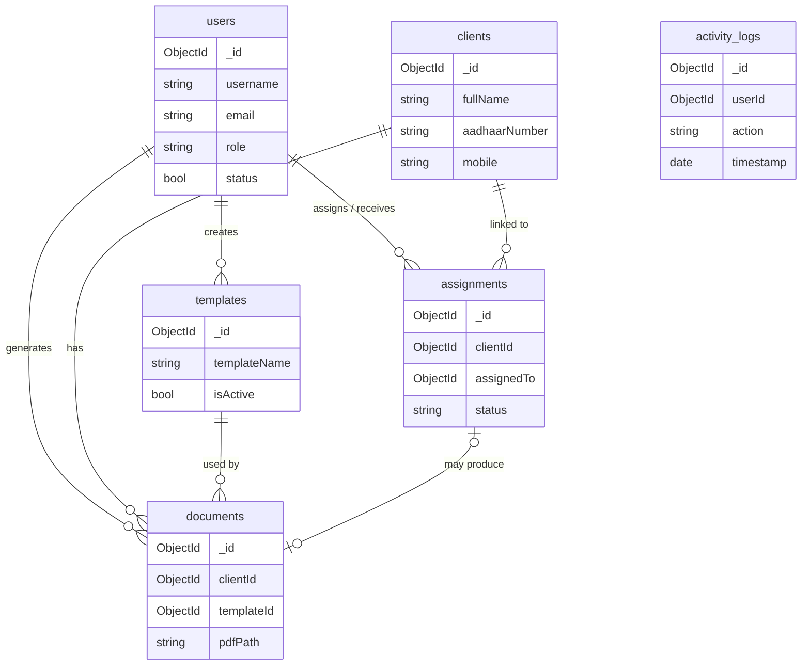

# NDAOMS — Database Architecture

**System:** Notary Document Automation and Office Management System  
**Database:** MongoDB (document-oriented)  
**Backend:** Python (FastAPI)  
**Version:** 1.0 (aligned with SRS)

---

## 1. Overview

NDAOMS stores office data in MongoDB collections. Generated PDF files are stored on the filesystem (or object storage); MongoDB keeps metadata and the file path.

Goals:

- Permanent client records reused across documents
- Fast search on name, Aadhaar, mobile, and document IDs
- Role-safe references between users, clients, templates, assignments, and documents
- Soft lifecycle for templates/users (deactivate, do not hard-delete history)

---

## 2. Collections Summary

| Collection | Purpose |
|------------|---------|
| `users` | Administrators and Junior Advocates |
| `clients` | Permanent client master records |
| `templates` | Reusable legal document templates |
| `documents` | Generated document metadata + PDF path |
| `assignments` | Work assigned to Junior Advocates |
| `activity_logs` | Audit trail for important actions |

Optional (v1 not required): `reports` — only if report history must be persisted; otherwise generate reports on demand from live collections.

---

## 3. Entity Relationship Diagram



### Relationship rules

| Parent | Child | Cardinality | Notes |
|--------|-------|-------------|-------|
| Users | Assignments | 1 : N | Admin assigns; Junior receives |
| Users | Documents | 1 : N | User who generated the PDF |
| Clients | Documents | 1 : N | Every document requires a client |
| Clients | Assignments | 1 : N | Every assignment requires a client |
| Templates | Documents | 1 : N | Historical docs keep `templateId` even if template is disabled |
| Assignments | Documents | 0..1 : 1 | Optional link; one assignment → at most one document in v1 |

---

## 4. Collection Schemas

ObjectIds are MongoDB `_id` values unless noted. Dates are UTC ISO-8601 stored as BSON `Date`.

### 4.1 `users`

| Field | Type | Required | Description |
|-------|------|----------|-------------|
| `_id` | ObjectId | auto | User ID |
| `fullName` | string | yes | Display name |
| `username` | string | yes | Unique login name |
| `email` | string | yes | Unique email |
| `passwordHash` | string | yes | bcrypt/argon2 hash (never plain text) |
| `mobile` | string | yes | Contact number |
| `role` | string | yes | `"admin"` \| `"junior"` |
| `status` | boolean | yes | `true` = active, `false` = inactive |
| `createdAt` | date | yes | Account creation |
| `updatedAt` | date | yes | Last profile/password change |

**Indexes**

- unique: `username`
- unique: `email`
- `role`, `status`

**Rules**

- Inactive users cannot authenticate.
- Only admins manage user accounts.

---

### 4.2 `clients`

| Field | Type | Required | Description |
|-------|------|----------|-------------|
| `_id` | ObjectId | auto | Client ID |
| `clientCode` | string | yes | Human-readable unique ID (e.g. `CLT-2026-0001`) |
| `fullName` | string | yes | Client name |
| `fatherName` | string | yes | Father's / husband's name |
| `gender` | string | yes | Gender |
| `dateOfBirth` | date | no | Optional |
| `mobile` | string | yes | Contact number |
| `address` | string | yes | Residential address |
| `aadhaarNumber` | string | yes | Unique Aadhaar (store carefully; see security) |
| `panNumber` | string | no | Optional PAN |
| `occupation` | string | no | Optional |
| `photoPath` | string | no | Path to profile image file |
| `idProofPath` | string | no | Path to identity proof file |
| `remarks` | string | no | Notes |
| `isActive` | boolean | yes | Soft archive flag (default `true`) |
| `createdAt` | date | yes | Registration date |
| `updatedAt` | date | yes | Last modification |

**Indexes**

- unique: `clientCode`
- unique: `aadhaarNumber`
- `fullName` (text or case-insensitive)
- `mobile`

**Rules**

- Never hard-delete clients; set `isActive: false` if needed.
- Duplicate Aadhaar is rejected.
- Documents always reference an existing client.

---

### 4.3 `templates`

| Field | Type | Required | Description |
|-------|------|----------|-------------|
| `_id` | ObjectId | auto | Template ID |
| `templateName` | string | yes | Unique name |
| `documentType` | string | yes | e.g. Affidavit, Declaration |
| `templateContent` | string | yes | Template body with placeholders (or path to DOCX) |
| `storageType` | string | yes | `"inline"` \| `"docx_file"` |
| `filePath` | string | no | Path if `storageType` is `docx_file` |
| `placeholders` | string[] | yes | e.g. `["ClientName", "Address", "AadhaarNumber"]` |
| `isActive` | boolean | yes | Only active templates appear in generation UI |
| `createdBy` | ObjectId | yes | Admin user `_id` |
| `createdAt` | date | yes | |
| `updatedAt` | date | yes | |

**Standard placeholders**

| Placeholder | Source |
|-------------|--------|
| `{{ClientName}}` | `clients.fullName` |
| `{{FatherName}}` | `clients.fatherName` |
| `{{Address}}` | `clients.address` |
| `{{AadhaarNumber}}` | `clients.aadhaarNumber` |
| `{{Occupation}}` | `clients.occupation` |
| `{{CurrentDate}}` | system date at generation |

Document-specific fields (property, witnesses, etc.) are supplied at generation time and are not stored on the client.

**Indexes**

- unique: `templateName`
- `documentType`, `isActive`

**Rules**

- Only admins create/edit/enable/disable templates.
- Disable (`isActive: false`) instead of hard-delete so historical documents remain valid.

---

### 4.4 `documents`

| Field | Type | Required | Description |
|-------|------|----------|-------------|
| `_id` | ObjectId | auto | Document ID |
| `documentCode` | string | yes | Human-readable unique ID (e.g. `DOC-2026-0001`) |
| `clientId` | ObjectId | yes | Ref → `clients` |
| `templateId` | ObjectId | yes | Ref → `templates` |
| `assignmentId` | ObjectId | no | Ref → `assignments` if created from a task |
| `generatedBy` | ObjectId | yes | Ref → `users` |
| `documentType` | string | yes | Copied from template at generation |
| `generatedContent` | string | no | Final editable content snapshot (optional) |
| `pdfPath` | string | yes | Absolute/relative path to archived PDF |
| `printStatus` | string | no | e.g. `"printed"` \| `"not_printed"` |
| `remarks` | string | no | |
| `generatedAt` | date | yes | Generation timestamp |
| `lastModifiedAt` | date | yes | Last content edit before PDF |

**Indexes**

- unique: `documentCode`
- `clientId`
- `generatedAt`
- `documentType`
- `generatedBy`
- `assignmentId`

**Rules**

- Archive automatically after successful PDF generation.
- PDF files are immutable; corrections require a new document.
- Every document references exactly one client.

---

### 4.5 `assignments`

| Field | Type | Required | Description |
|-------|------|----------|-------------|
| `_id` | ObjectId | auto | Assignment ID |
| `assignmentCode` | string | yes | Human-readable unique ID |
| `clientId` | ObjectId | yes | Ref → `clients` |
| `documentType` | string | yes | Required document type |
| `templateId` | ObjectId | no | Preferred template (optional) |
| `assignedTo` | ObjectId | yes | Ref → Junior `users` |
| `assignedBy` | ObjectId | yes | Ref → Admin `users` |
| `status` | string | yes | `"assigned"` \| `"in_progress"` \| `"completed"` |
| `dueDate` | date | no | Optional deadline |
| `remarks` | string | no | |
| `assignedAt` | date | yes | |
| `completedAt` | date | no | Set when status → `completed` |
| `documentId` | ObjectId | no | Ref → `documents` when work is finished |

**Indexes**

- unique: `assignmentCode`
- `assignedTo`, `status`
- `clientId`
- `assignedAt`

**Rules**

- Only admin assigns/reassigns.
- One Junior per assignment at a time.
- Completed assignments remain for history and reports.

---

### 4.6 `activity_logs`

| Field | Type | Required | Description |
|-------|------|----------|-------------|
| `_id` | ObjectId | auto | |
| `userId` | ObjectId | yes | Actor |
| `action` | string | yes | e.g. `login`, `client.create`, `document.generate` |
| `module` | string | yes | e.g. `auth`, `clients`, `documents` |
| `entityType` | string | no | `client`, `document`, etc. |
| `entityId` | ObjectId | no | Related record |
| `metadata` | object | no | Non-sensitive details |
| `ipAddress` | string | no | Optional |
| `timestamp` | date | yes | |

**Indexes**

- `userId`, `timestamp`
- `action`, `timestamp`

**Logged events (minimum)**

- Login / logout
- Client create / update
- Template create / update / disable
- Document generate
- Assignment create / reassign / status change

---

## 5. Data Integrity

Enforced in the FastAPI application layer (and unique indexes where possible):

1. Every `documents.clientId` must exist in `clients`.
2. Every `documents.templateId` must exist in `templates`.
3. Every `documents.generatedBy` must exist in `users`.
4. Every `assignments.assignedTo` must be a user with `role: "junior"` and `status: true`.
5. Unique: username, email, Aadhaar, template name, client/document/assignment codes.
6. Disabling a template must not delete or unlink existing documents.
7. Client hard-delete is forbidden.

---

## 6. File Storage Layout

MongoDB stores paths only. Suggested on-disk layout:

```text
storage/
  clients/
    {clientId}/
      photo.*
      id-proof.*
  documents/
    {yyyy}/
      {mm}/
        {documentCode}.pdf
  templates/
    {templateId}.docx   # if using file-based templates
```

Backup must include **MongoDB dump + `storage/` directory**.

---

## 7. Recommended Indexes (quick reference)

```javascript
// users
db.users.createIndex({ username: 1 }, { unique: true })
db.users.createIndex({ email: 1 }, { unique: true })

// clients
db.clients.createIndex({ clientCode: 1 }, { unique: true })
db.clients.createIndex({ aadhaarNumber: 1 }, { unique: true })
db.clients.createIndex({ mobile: 1 })
db.clients.createIndex({ fullName: "text" })

// templates
db.templates.createIndex({ templateName: 1 }, { unique: true })
db.templates.createIndex({ isActive: 1, documentType: 1 })

// documents
db.documents.createIndex({ documentCode: 1 }, { unique: true })
db.documents.createIndex({ clientId: 1, generatedAt: -1 })
db.documents.createIndex({ documentType: 1, generatedAt: -1 })
db.documents.createIndex({ generatedBy: 1 })

// assignments
db.assignments.createIndex({ assignmentCode: 1 }, { unique: true })
db.assignments.createIndex({ assignedTo: 1, status: 1 })
db.assignments.createIndex({ clientId: 1 })

// activity_logs
db.activity_logs.createIndex({ timestamp: -1 })
db.activity_logs.createIndex({ userId: 1, timestamp: -1 })
```

---

## 8. Security Notes (data layer)

- Store only password hashes (`passwordHash`), never plain passwords.
- Restrict direct MongoDB access to server credentials.
- Treat Aadhaar and ID proofs as sensitive PII; limit API exposure and log access carefully.
- Prefer HTTPS for all API traffic.
- Prefer environment variables for DB URI and JWT secrets (never commit secrets).

---

## 9. Alignment with SRS Modules

| Module | Collections |
|--------|-------------|
| FM-01 Auth & Users | `users`, `activity_logs` |
| FM-02 Dashboard | Aggregations over `clients`, `documents`, `assignments` |
| FM-03 Clients | `clients` |
| FM-04 Templates | `templates` |
| FM-05 Document generation | `documents`, `clients`, `templates` |
| FM-06 Work assignment | `assignments` |
| FM-07 Archive | `documents` (+ files under `storage/documents`) |
| FM-08 Reports | Live queries / aggregations (no required `reports` collection) |

---

## 10. Related docs

- [API Flow](./api-flow.md) — FastAPI endpoints and request sequences
- `SRS.pdf` — full requirements source
